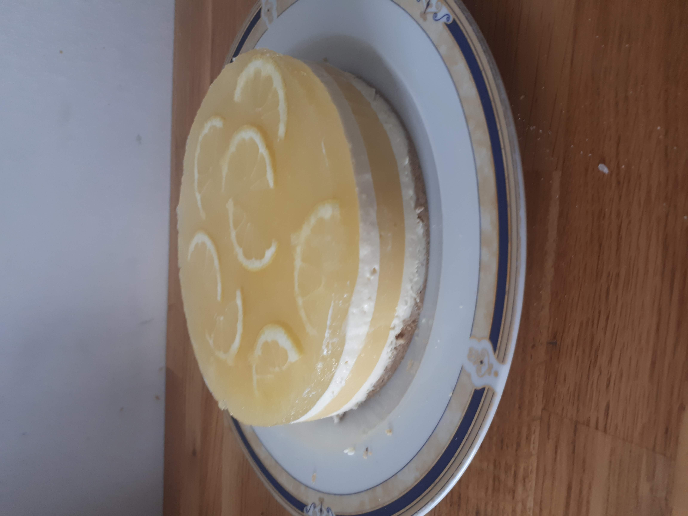
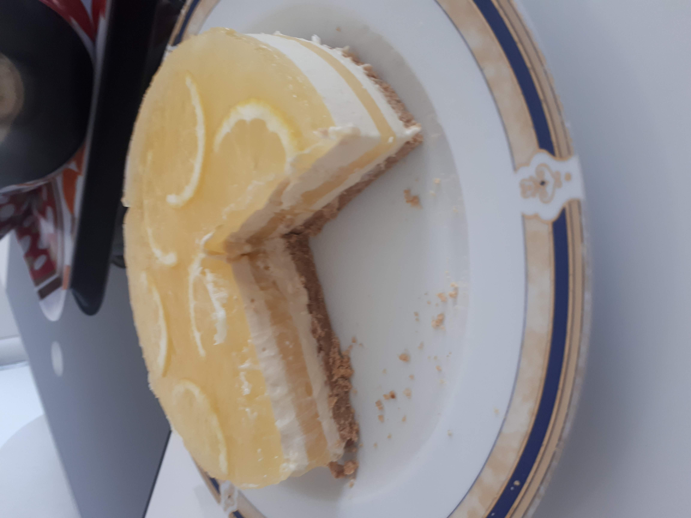
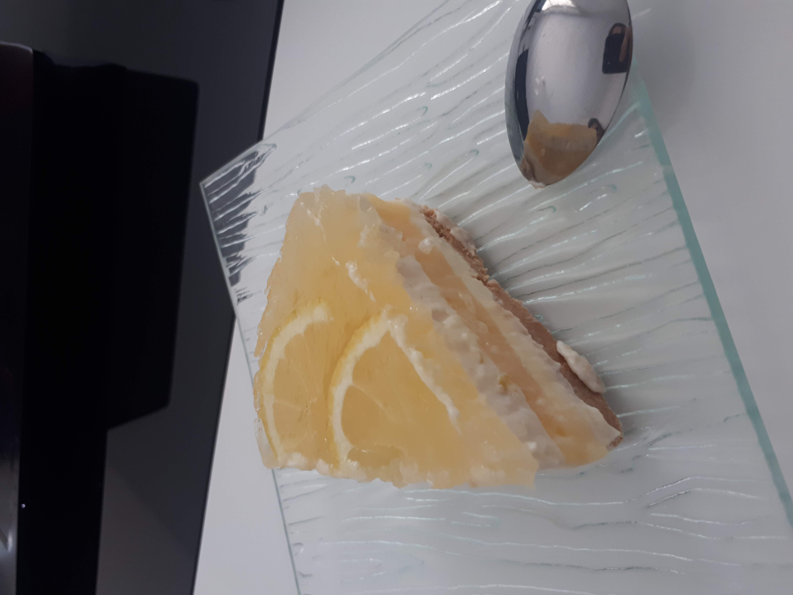

# Cheesecake citron sans cuisson

Catégories : Dessert

Tags : Dessert, Sans cuisson, Cheesecake

Pour 1 gateau de 16 cm diamètre (8 personnes)

Servir froid

/!\\ A préparer au moins 3h avant de servir

**Temps de préparation :** 1h

**Temps de cuisson :** /

## Ustensiles

* Cercle de cuisson de 15 cm ou 16 cm
* Bols (Kitchen aid)
* Petit bol pour mettre la gélatine au micro-onde
* Une casserole
* Spatule
* Fouet

## Ingrédients

### Pour le gateau

* 80 g Petit beurre
* 40 g Beurre

### Pour la préparation crémeuse

* 200 g Cream cheese (Philadelphia)
* 50 g Sucre blanc
* 40 g Yaourt
* 1cc Arôme de vanille
* Zeste d'un citron
* 4 g gélatine (2 feuilles)
* 120 g Crème fraîche liquide entière

### Pour le lemon curd

* 75 g eau
* 60 g jus de citron
* 45 g sucre
* 15 g maizena
* 15 g beurre
* 1 jaune d'oeuf
* 2 g gélatine (1 feuille)

### Pour le glacage citron

* 3 citron (100 g de supreme de citron)
* 50 g sucre
* 50 g eau
* 5 g gélatine

## Étapes

### Gateau

1. Mixer au Thermomix les petit beurre environ 20s à 4 (les petits beurres doivent être réduits en poudre)
2. Faire fondre au micro-onde le beurre dans un bol
3. Ajouter les petits beurres en poudre dans le bol et mélanger
4. Préparer le cercle de cuisson avec du rhodoïd, et le placer sur un plat
5. Répartir de façon homogène le mélange beurre / petit beurre dans le cercle de cuisson et tasser
6. Réserver au réfrigérateur

### Préparation crémeuse

1. Mettre les feuilles de gélatine à tremper dans de l'eau froide (environ 10 min)
2. Faire fondre au micro ondes le cream cheese, jusque ce soit onctueux
3. Dans un grand saladier (ou kitchen aid) verser le cream cheese et le fouetter
4. Ajouter le yaourt à la grec, le sucre, la vanille dans le saladier et mélanger au fouet
5. Ajouter le zeste de citron
6. Essorer la gélatine
7. Mettre la gélatine essoré dans un bol et la faire chauffer au micro onde 10s (doit être fondu)
8. Ajouter la gélatine à la préparation et mélanger
9. Ajouter la crème fraîche et mélanger au fouet
10. Sortir le gateau avec le cercle de cuisson du réfrigérateur
11. Verser dans le cercle de cuisson la **moitié** de la préparation
12. Mettre au congélateur 20 min

### Lemon curd

1. Mettre les feuilles de gélatine à tremper dans de l'eau froide (environ 10 min)
2. Dans une casserole verser l'eau, le jus de citron, le sucre
3. Prendre un peu de la préparation de la caserole et mélanger à la maizena
4. Incorporer la maizena diluer dans la casserole
5. Mélanger
6. Chauffer à feu moyen tout en mélanger avec une spatule en continue pour avoir un mélange lisse et ce jusqu'à aipaissiement, il faut que la préparation soit assez épaisse pour pouvoir la bouger avec la spatule en voyant le fond qui ne se rebouche pas aussitot voir pas du tout, aspect de lemon curd
7. Retirer du feu
8. Ajouter le beurre et mélanger
9. Ajouter le jaune d'oeuf et mélanger
8. Essorer la gélatine et l'ajouter dans la caserole et mélanger
10. Sortir de gateau du congélateur
11. Verser sur le gateau dans le cercle de cuisson la préparation, répartir uniformément
12. Mettre au congélateur 20 min

### Préparation crémeuse

1. Sortir de gateau du congélateur
2. Verser dans le cercle de cuisson l'autre **moitié** de la préparation crémeuse
3. Mettre au congélateur 20 min

### Glacage

1. Mettre les feuilles de gélatine à tremper dans de l'eau froide (environ 10 min)
2. Couper un citron en 2, 
3. Couper cette moitité de citron en 2 dans l'autre, puis couper de sorte à avoir 8 demi-rondelles de citron fines
4. Mettre les demi-rondelles de côté
5. Récupérer les supremme du reste des citrons (~100g)
6. Dans une casserole verser les supremmes de citron et le sucre et mélanger à l'aide d'une spatule
7.  Chauffer à feu moyen tout en mélanger, casser les morceaux de supremes
8.  Ajouter l'eau
9.  Retirer du feu
10. Essorer la gélatine et l'ajouter dans la caserole et mélanger
11. Attendre que le mélange refroidisse un peu (~10min)
12. Sortir de gateau du congélateur
13. Verser sur le gateau dans le cercle de cuisson la préparation, répartir uniformément
14. Déposer les demi-rondelles de citrons sur les dessus et les enfoncer dans la préparation afin qu'elles soit recouvertes
15. Mettre au congélateur 20 min
15. Mettre au réfrigérateur au moins une heure avant de déguster

## Inspirations

* [Youtube Cooking tree : No-Bake Lemon Cheesecake Recipe](https://www.youtube.com/watch?v=TJgqyUUNYhA)
