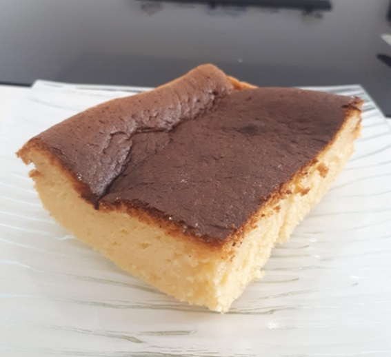

# Cheesecake japonais

Catégories : Dessert

Tags : Cheesecake, Dessert, Froid

Pour 12 parts

Temps de préparation : 15 min
Temps de cuisson : 48 min
Temps de refroidissement : 1 h

## Apports nutritionnels

### Total

* 550 kcal total
* 51,9 g glucides
* 35,1 g protéines
* 22,5 g lipides

### Par portion

1 portion = 1 ramequin

* 110 kcal par ramequins
* 10,4 g glucides
* 7,0 g protéines
* 4,5 g lipides

## Ustensiles

* 1 moule à gâteau de 20 cm x 8cm avec fond
* 1 grand plat pour cuire au bain marie dans le four
* 2 grands saladier
* Kitchen aid ou (un batteur et un saladier)
* Four

## Ingrédients

* 250 g Philadelphia
* 6 oeufs **A vérifier**, il doit y avoir ~120g jaunes et ~265g blancs
* 1/4 cc de crème de tartre (facultatif)
* 140 g sucre en poudre
* 60 g beurre doux
* 100 ml de lait entier
* 1 cs jus de citron
* 2 cc zeste de citron
* 60 g farine T45
* 20 g fécule de maïs
* 1/4 cc sel

## Étapes

1. Préchauffer le four à 200 ° C (sans chaleur tounante)
3. Séparer les blanc et les jaunes oeufs (mettre les blancs dans le bol du kitchen aid)
4. Mixer au thermomix la moitié du sucre pour qu'il soit fin
5. Graisser un moule à gâteau avec du beurre, tapisser le seulement fond de papier sulfurisé (si l'on tapisse le côté, cela causera un côté froissé, lorsque le gâteau rétrécit, il fera glisser le papier vers le bas et provoquera le pli)
6. Prendre un grand saladier et mettre de l'eau chaude dedans (environ 1/3)
7. Mettre un deuxième saladier sur le premier pour faire un bain marie
8. Mettre le Philadelphia dans le saladier et fouetter jusqu'à ce qu'il soit lisse
9. Ajouter les jaunes et fouetter
10. Ajouter la moitié du sucre (70 g) et fouetter
11. Faire chauffer le lait et le beurre au micro-ondes (élevé, 1 min), et l'ajouter au mélange et fouetter
12. Ajouter le sel, le jus de citron, le zeste de citron et fouetter
13. Retirer du bain-marie, tamiser la farine et la fécule de maïs et incorporer au mélange
14. Vérifier que les blancs d'oeufs sont à température ambiante
15. Fouetter les blancs avec le kitchen aid à basse vitesse jusqu'à ce qu'ils soient mousseux
16. Ajouter la crème de tartre et battre à grande vitesse jusqu'à ce que les bulles deviennent très petites mais toujours visibles
17. Ajouter graduellement les 70 grammes de sucre restant et battre jusqu'à ce qu'il y est un pic mou au bout du fouet quand on le retire (la méringue doit être douce pour minimiser le dégonflage des minuscules poches d'air dans la meringue)
18. Ajouter les blancs à la pâte en trois fois, la pâte et les blancs d'œufs doivent être bien incorporés et mélangés.
19. Verser dans le moule à gâteau et tapoter le moule sur le plan de cuisine pour libérer les bulles d'air, le moule doit être rempli à mi-hauteur
20. Préparer le plat pour le bain marie en plaçant une petite serviette au fond (pour agir comme une couche d'isolant mince pour le moule à gâteau afin que le fond soit bien protégé de la chaleur directe) et remplir d'eau chaude à environ 4 cm de haut après avoir placé le moule à gâteau sur le plat.
21. Cuire au bain-marie sur la grille inférieure dans un four préchauffé endant 18 minutes
22. Puis baisser à 140 ° C pendant 30 minutes supplémentaires (laisser la chaleur du four baisser progressivement avec la porte fermée)
23. Eteindre le four et laissez le gâteau dans le four fermé pendant 30 minutes supplémentaires.
24. Retirer le bain-marie et ouvrir légèrement la porte du four en mettant un gant de cuisine dans dans l'ouverture du four pour la bloquer et laisser pendant 30 minutes supplémentaires pour que le gâteau refroidisse.
25. Sortir le moule du four (il doit pouvoir être manipulé à la main). Utiliser une assiette pour couvrir le moule à gâteau, retourner le moule et retirez délicatement le moule. Retirez la doublure inférieure et placez une autre planche à gâteau ou une assiette sur le fond du gâteau, inversez-la. Le gâteau doit être doux et moelleux et jiggly quand il est encore chaud. 
26. Laisser le gâteau refroidir avant de l'envoyer au réfrigérateur. La taille finale du gâteau après retrait est d'environ 19 cm x 7,5 cm (point le plus élevé)
27. Décorez le dessus de sucre glace à l'aide d'un pochoir
28. Pour le servir coupez le gâteau avec un couteau chaud, essuyez le couteau avant la prochaine coupe.

## Remarques

La temérature dans le four est crucial. La température indiquée dans la recette est la température au four. Chaque four est différent, donc si vous n'êtes pas trop sûr si la température à l'intérieur de votre four est exacte comme ce que vous avez réglé sur le panneau de commande, utiliser un thermomètre de four pour vérifier.

## Inspirations

* https://www.craftpassion.com/light-japanese-cheesecake/