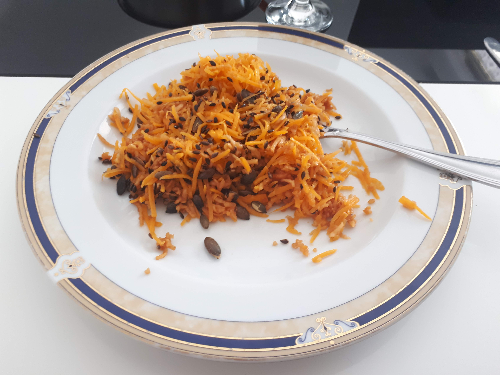

# Salade de potiron bleu de Hongrie

Catégories : Salade, Accompagnement, Entrée

Tags : Potiron bleu, Salade

Pour 2 portions

**Temps de préparation :** 20 min

**Temps de cuisson :** /

## Ustensiles

* rappe (ou robot pour rapper)
* 1 saladier moyen
* 1 poele
* 1 petit bol pour la vinaigrette

## Ingrédients

* 1 quartier de portiron bleue de Hongrie
* 1 pommes
* 15 g graines de courge
* 8 g graine de lin
* 1 cc moutarde
* 1 cs huile de courge (ou noix)
* 2 cs vinaigre de cidre
* 1 cs eau
* sel
* poivre

## Étapes

1. Retirer les pépins et la peau de la courge
2. Epépiner la pomme et l'éplucher
3. Rapper dans un saladier la courge et la pomme et réserver au réfrigirateur
4. Dans un petit bol, préparer la vinaigrette en mélangeant la moutarde et l'huile
5. Ajouter le vinaigre, l'eau, le sel et le poivre, et mélanger
6. Réserver a vinaigrette au réfrigirateur
7. Mettre les graines de gourges et de lin dans une poêle et couvrir, faire toréfier à feu vif (7) pendant 4 min en secouant la poêle régulièrement
8. Mettre les graines dans un petit bol et mettre de côté
9. Au moment de servir ajouter la vinaigrette et les graines à la courge et la pomme rapées et servir

## Variantes

* Il est possile d'utilisier du potimarron, à la place du portiron bleue de Hongrie

## Inspirations

* [Cuisine en bandouliere : Salade de potiron bleu de Hongrie](http://www.cuisineenbandouliere.com/salade-de-potiron-bleu-de-hongrie/)
